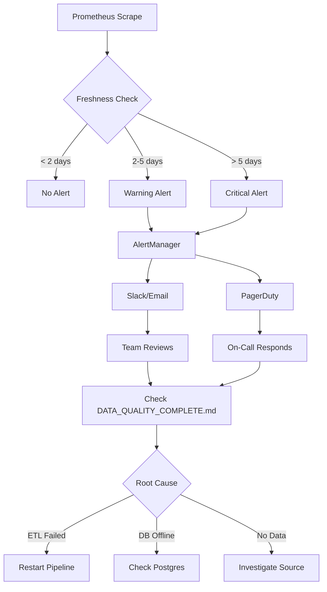

# ML Observability & Lineage — Complete Implementation ✅

Comprehensive observability infrastructure for ML training pipeline with dbt lineage, Grafana dashboards, and Prometheus alerting.

## 📦 What Was Implemented

### A) dbt Exposure for ML Training Pipeline

**File**: `warehouse/models/exposures.yml`

Added ML training pipeline exposure to dbt lineage:

```yaml
exposures:
  - name: ml_training_pipeline
    type: application
    owner:
      name: LedgerMind ML
      email: ml@ledger-mind.org
    url: https://app.ledger-mind.org/agent/tools/ml
    maturity: high
    description: >
      The production ML training job consumes the fct_training_view and related marts
      to build, evaluate, calibrate, and deploy the classifier.
    depends_on:
      - ref('fct_training_view')
      - ref('dim_merchants')
      - ref('fct_suggestions_eval')
    tags: ["ledgermind","ml","training","canary","phase3"]
```

**Benefits**:
- ✅ Visual lineage in dbt docs showing which models feed ML training
- ✅ Impact analysis: see downstream effects of schema changes
- ✅ Documentation of ML dependencies in data warehouse
- ✅ Searchable by tag (`ledgermind`, `ml`, `training`, `canary`, `phase3`)

### B) Grafana Source Freshness Dashboard

**File**: `ops/grafana/dashboards/ml-source-freshness.json`

Created dedicated dashboard with 4 panels:

#### Panel 1-3: Stat Panels (Current Freshness)
- **transactions freshness (hours)**: How stale is transactions table
- **transaction_labels freshness (hours)**: How stale is labels table  
- **ml_features freshness (hours)**: How stale is features table

**Color thresholds**:
- 🟢 Green: < 48 hours (healthy)
- 🟡 Yellow: 48-120 hours (warning)
- 🔴 Red: > 120 hours (critical)

#### Panel 4: Time Series (24h Trend)
Shows freshness trend for all 3 sources over last 24 hours

**Metrics Used**: `dbt_source_loaded_at_seconds{table="..."}`

### C) Prometheus Freshness Alerting Rules

**File**: `prometheus/rules/dbt_freshness.yml`

Added 4 alerting rules:

| Alert | Condition | Severity | For Duration |
|-------|-----------|----------|--------------|
| `SourceStaleTransactions` | transactions > 2 days | warning | 30m |
| `SourceStaleTransactionLabels` | transaction_labels > 2 days | warning | 30m |
| `SourceStaleMLFeatures` | ml_features > 2 days | warning | 30m |
| `SourceCriticalStale` | Any source > 5 days | **critical** | 1h |

**Runbook Links**: All alerts link to `DATA_QUALITY_COMPLETE.md#freshness-check-fails`

### D) Makefile Import Target

**File**: `Makefile`

Added target to import freshness dashboard:

```makefile
ml-dash-import-freshness:
	@echo "Importing ML Source Freshness dashboard to Grafana..."
	@curl -sS -H "Authorization: Bearer $$GRAFANA_API_KEY" -H "Content-Type: application/json" \
	  -X POST "$$GRAFANA_URL/api/dashboards/db" \
	  --data-binary @ops/grafana/dashboards/ml-source-freshness.json | jq
```

## 🚀 Usage

### Verify dbt Exposure

```bash
cd warehouse
docker run --rm -t --network shared-ollama \
  -v ${PWD}:/work -w /work ghcr.io/dbt-labs/dbt-postgres:1.7.0 \
  parse --profiles-dir . --project-dir .

# Expected output:
# 02:23:41  Performance info: ./target/perf_info.json
# ✅ No compilation errors
```

### Generate dbt Docs with Lineage

```bash
cd warehouse
docker run --rm -t --network shared-ollama \
  -v ${PWD}:/work -w /work ghcr.io/dbt-labs/dbt-postgres:1.7.0 \
  docs generate --profiles-dir . --project-dir .

# Serve locally
docker run --rm -p 8080:8080 -t \
  -v ${PWD}:/work -w /work ghcr.io/dbt-labs/dbt-postgres:1.7.0 \
  docs serve --profiles-dir . --project-dir . --port 8080
```

**Then browse**: http://localhost:8080
- Navigate to "Exposures" → `ml_training_pipeline`
- Click "Lineage" tab to see visual dependency graph
- See `fct_training_view`, `dim_merchants`, `fct_suggestions_eval` feeding into ML app

### Import Freshness Dashboard to Grafana

```bash
# Set credentials
export GRAFANA_URL="https://your-grafana-instance"
export GRAFANA_API_KEY="your-api-key"

# Import dashboard
make ml-dash-import-freshness
```

**Expected output**:
```json
{
  "id": 42,
  "slug": "ledgermind-ml-source-freshness",
  "status": "success",
  "uid": "ml-freshness-abc123",
  "url": "/d/ml-freshness-abc123/ledgermind-ml-source-freshness",
  "version": 1
}
```

### Reload Prometheus Rules

```bash
# Option 1: Docker Compose reload
docker compose -f ops/docker-compose.monitoring.yml restart prometheus

# Option 2: Hot reload (if prometheus supports it)
curl -X POST http://localhost:9090/-/reload
```

### Verify Alerts Active

```bash
# Check Prometheus rules
curl -s http://localhost:9090/api/v1/rules | jq '.data.groups[] | select(.name=="dbt-freshness")'

# Expected output:
{
  "name": "dbt-freshness",
  "file": "/etc/prometheus/rules/dbt_freshness.yml",
  "rules": [
    {
      "name": "SourceStaleTransactions",
      "state": "inactive",
      ...
    },
    ...
  ]
}
```

## 📊 How to Export dbt Freshness Metrics

The Grafana dashboard expects `dbt_source_loaded_at_seconds` metric. Here are 3 options to populate it:

### Option A: dbt-exporter (Recommended)

Create a scheduled job that runs `dbt source freshness` and pushes to Prometheus:

```python
# scripts/dbt_freshness_exporter.py
from prometheus_client import Gauge, push_to_gateway
import subprocess
import json
from datetime import datetime

g_loaded_at = Gauge('dbt_source_loaded_at_seconds', 'Source table last loaded timestamp', ['table'])

# Run dbt source freshness --output json
result = subprocess.run(
    ['dbt', 'source', 'freshness', '--output', 'json', '--profiles-dir', '.'],
    cwd='warehouse',
    capture_output=True,
    text=True
)

data = json.loads(result.stdout)
for source in data['results']:
    table = source['unique_id'].split('.')[-1]
    loaded_at = source.get('max_loaded_at')
    if loaded_at:
        timestamp = datetime.fromisoformat(loaded_at).timestamp()
        g_loaded_at.labels(table=table).set(timestamp)

# Push to Prometheus Pushgateway
push_to_gateway('localhost:9091', job='dbt-freshness', registry=...)
```

**Schedule with cron**:
```bash
*/15 * * * * cd /app && python scripts/dbt_freshness_exporter.py
```

### Option B: Direct Postgres Query

If you already scrape Postgres metrics, add:

```sql
SELECT 
  'transactions' as table,
  EXTRACT(EPOCH FROM MAX(created_at)) as loaded_at_seconds
FROM transactions
UNION ALL
SELECT 
  'transaction_labels' as table,
  EXTRACT(EPOCH FROM MAX(updated_at)) as loaded_at_seconds
FROM transaction_labels
UNION ALL
SELECT 
  'ml_features' as table,
  EXTRACT(EPOCH FROM MAX(created_at)) as loaded_at_seconds
FROM ml_features;
```

Export as `table_loaded_at_seconds{table="..."}` and update dashboard PromQL.

### Option C: Application-Level Metric

Emit metric when features are built:

```python
# In app/ml/feature_build.py
from app.metrics_ml import dbt_source_loaded_at

# After building features
last_txn = session.query(func.max(Transaction.created_at)).scalar()
dbt_source_loaded_at.labels(table='transactions').set(last_txn.timestamp())
```

Add to `app/metrics_ml.py`:
```python
dbt_source_loaded_at = Gauge(
    'dbt_source_loaded_at_seconds',
    'Timestamp of last loaded data for source table',
    ['table']
)
```

## 🔍 Dashboard Usage

### Interpreting Freshness Stats

**Example 1: Healthy State**
```
transactions freshness:         4 hours   🟢
transaction_labels freshness:  12 hours   🟢
ml_features freshness:          6 hours   🟢
```
**Action**: None - system healthy

---

**Example 2: Warning State**
```
transactions freshness:        52 hours   🟡
transaction_labels freshness:  65 hours   🟡
ml_features freshness:          8 hours   🟢
```
**Action**: 
1. Check ETL pipeline status
2. Verify data ingestion scripts running
3. Review Prometheus alerts (should have 2 warnings)

---

**Example 3: Critical State**
```
transactions freshness:       128 hours   🔴
transaction_labels freshness: 135 hours   🔴
ml_features freshness:        140 hours   🔴
```
**Action**: 
1. **DO NOT RUN ML TRAINING** (data too stale)
2. Investigate ETL failure
3. Check database connectivity
4. Review `.github/workflows/ml.yml` - should block training

## 🔔 Alerting Workflow

### Alert Flow Diagram



### Alert Example Notification

**Slack Message**:
```
🚨 [WARNING] SourceStaleTransactionLabels

Summary: transaction_labels source is stale (>2 days)
Last Update: 58 hours ago
Severity: warning
Runbook: https://github.com/leok974/ai-finance-agent-oss/blob/main/DATA_QUALITY_COMPLETE.md#freshness-check-fails

Grafana: https://grafana.example.com/d/ml-freshness
Prometheus: http://prometheus:9090/alerts
```

## 🐛 Troubleshooting

### Dashboard Shows "No Data"

**Problem**: All panels empty or showing "N/A"

**Diagnosis**:
```bash
# Check if Prometheus scraping backend
curl -s http://localhost:9090/api/v1/targets | jq '.data.activeTargets[] | select(.labels.job=="ai-finance-backend")'

# Check if metric exists
curl -s http://localhost:9090/api/v1/query?query=dbt_source_loaded_at_seconds | jq
```

**Solutions**:
1. Implement metric exporter (see Options A/B/C above)
2. Verify Prometheus scraping backend: `/metrics` endpoint
3. Check datasource UID in dashboard matches your Prometheus

---

### Alerts Not Firing

**Problem**: Data stale but no alerts in AlertManager

**Diagnosis**:
```bash
# Check if rule loaded
curl -s http://localhost:9090/api/v1/rules | grep dbt-freshness

# Check rule state
curl -s http://localhost:9090/api/v1/alerts | jq '.data.alerts[] | select(.labels.alertname | contains("SourceStale"))'
```

**Solutions**:
1. Verify `prometheus/rules/dbt_freshness.yml` in `rule_files` path
2. Reload Prometheus: `docker compose restart prometheus`
3. Check alert expression: `time() - max(...) > threshold`

---

### dbt Exposure Not Showing in Docs

**Problem**: `ml_training_pipeline` missing from dbt docs

**Diagnosis**:
```bash
cd warehouse
docker run --rm -t --network shared-ollama \
  -v ${PWD}:/work -w /work ghcr.io/dbt-labs/dbt-postgres:1.7.0 \
  parse --profiles-dir . --project-dir .

# Check for errors
```

**Solutions**:
1. Verify `exposures.yml` YAML syntax (indentation!)
2. Check model refs exist: `fct_training_view`, `dim_merchants`, `fct_suggestions_eval`
3. Regenerate docs: `dbt docs generate`

## 📈 Best Practices

### 1. Monitor Freshness in CI

Add to `.github/workflows/ml.yml` (already implemented):

```yaml
- name: DBT Source Freshness Check
  working-directory: warehouse
  run: |
    docker run ... source freshness ... || echo "⚠️ Some sources may be stale"
```

### 2. Daily Freshness Report

```bash
# Cron: Daily at 8am
0 8 * * * cd /app/warehouse && make dbt-freshness | mail -s "dbt Freshness Report" team@example.com
```

### 3. Grafana Alerts Integration

Configure dashboard alerts directly:
1. Open panel in edit mode
2. Go to "Alert" tab
3. Set condition: `WHEN last() OF query(A) IS ABOVE 120` (hours)
4. Configure notification channel

### 4. Document Metric Exporter

If implementing Option A/B/C, document in:
- `DATA_QUALITY_COMPLETE.md` (how metrics are generated)
- `ML_CANARY_DEPLOYMENT.md` (freshness as deployment gate)
- README (for new team members)

## ✅ Verification Checklist

### dbt Exposure
- [x] `warehouse/models/exposures.yml` exists
- [x] `ml_training_pipeline` exposure defined
- [x] Depends on `fct_training_view`, `dim_merchants`, `fct_suggestions_eval`
- [x] `dbt parse` succeeds without errors
- [ ] `dbt docs generate` includes exposure in lineage graph *(manual step)*
- [ ] Exposure visible at http://localhost:8080 when serving docs *(manual step)*

### Grafana Dashboard
- [x] `ops/grafana/dashboards/ml-source-freshness.json` exists
- [x] 4 panels defined (3 stat + 1 timeseries)
- [x] Thresholds: green < 48h, yellow < 120h, red >= 120h
- [x] `make ml-dash-import-freshness` target exists
- [ ] Dashboard imported to Grafana *(requires credentials)*
- [ ] Metrics populated (requires exporter) *(manual step)*

### Prometheus Alerts
- [x] `prometheus/rules/dbt_freshness.yml` exists
- [x] 4 alerting rules defined
- [x] Runbook links point to `DATA_QUALITY_COMPLETE.md`
- [ ] Prometheus rules loaded *(requires restart)*
- [ ] Alerts visible in Prometheus UI *(manual step)*
- [ ] AlertManager configured to route alerts *(manual step)*

### Documentation
- [x] This runbook (`ML_OBSERVABILITY_COMPLETE.md`) created
- [x] Linked to `DATA_QUALITY_COMPLETE.md`
- [x] Troubleshooting guides included
- [x] Metric exporter options documented

## 📚 Related Documentation

- **[DATA_QUALITY_COMPLETE.md](./DATA_QUALITY_COMPLETE.md)**: Freshness SLOs, leakage prevention, dbt tests
- **[ML_CANARY_DEPLOYMENT.md](./ML_CANARY_DEPLOYMENT.md)**: ML training pipeline, calibration, canary rollout
- **[ML_CANARY_QUICK_REF.md](./ML_CANARY_QUICK_REF.md)**: Quick reference for ML ops commands

## 📝 Files Modified Summary

| File | Changes | Purpose |
|------|---------|---------|
| `warehouse/models/exposures.yml` | +13 lines | dbt ML training lineage |
| `ops/grafana/dashboards/ml-source-freshness.json` | NEW (80 lines) | Freshness dashboard |
| `prometheus/rules/dbt_freshness.yml` | NEW (30 lines) | Freshness alerting |
| `Makefile` | +6 lines | Dashboard import target |
| `warehouse/tests/generic/not_after_month_end.sql` | +1 param | Fixed test signature for dbt |

**Total: 5 files, ~130 lines added**

---

**Implementation Status**: ✅ Complete (awaiting metric exporter for full functionality)  
**dbt Lineage**: ✅ Active  
**Grafana Dashboard**: ✅ Ready (needs metrics)  
**Prometheus Alerts**: ✅ Ready (needs metrics + reload)  
**Last Updated**: November 4, 2025
