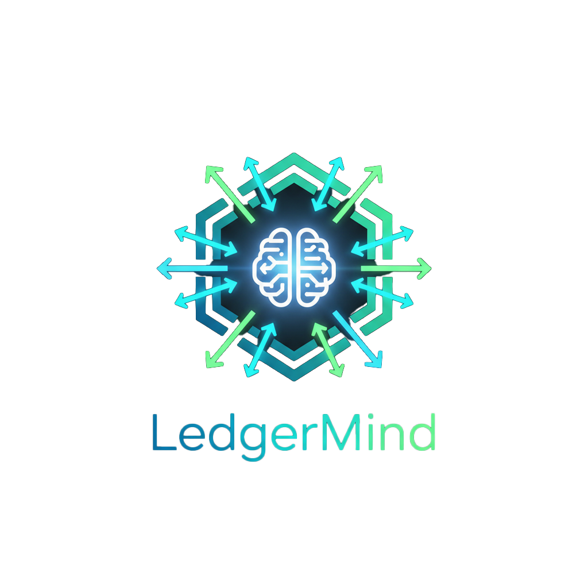

<div align="center">
  
</div>

# LedgerMind

**AI-powered personal finance dashboard with intelligent categorization, analytics, and natural-language assistance**

**Live Demo:** [https://app.ledger-mind.org](https://app.ledger-mind.org)

✔ No signup required — Demo Mode available
✔ Google OAuth supported (secure + fully isolated from demo users)

---

## 🚀 Overview

LedgerMind is a **production-ready** personal finance platform combining:

- **Transaction ingestion** (CSV/Excel, multi-bank formats)
- **AI categorization** (ML model + merchant priors + heuristics)
- **Rich financial analytics** (top categories, merchants, trends, forecasts)
- **Chat assistant** powered by LLMs + RAG (pgvector)
- **Secure multi-tenancy** with Google OAuth, session auth, KMS encryption
- **Demo Mode** so users can try the product instantly

Perfect for showcasing full-stack engineering, AI/ML integration, and DevOps expertise.

---

## ⭐ Key Features

### Transaction Import
- CSV/Excel ingest (auto-detect columns)
- Multi-bank normalization
- Duplicate detection & cleanup

### AI-Enhanced Categorization
- ML suggestions w/ confidence scores
- Merchant-based rules
- Suggestion feedback loop (accept/reject)
- Undo support (per transaction + bulk)

### Analytics Dashboard
- Top categories & merchants
- Daily/Monthly spend flows
- Forecasting & anomaly detection
- Rich charts (React + Recharts)

### Natural-Language Assistant (ChatDock)
Ask questions like:
- *"How much did I spend on food last month?"*
- *"Summarize my biggest trends this quarter."*

Streaming LLM with retrieval via **pgvector**

### Demo Mode
- Try LedgerMind instantly
- Fully isolated `DEMO_USER_ID=1`
- Cannot leak into real user data
- Resettable with one click

---

## 🔐 Security & Authentication

### Google OAuth (Production-Ready)
- OAuth accounts linked by `provider` + `sub` claim
- Email + profile sync
- No duplicate users
- CSRF (`state`) + PKCE enforced
- **Demo user is protected** — OAuth cannot link to demo accounts

### Application Security
- **KMS envelope encryption** for sensitive fields
- **CSP hash-based runtime policy**
- **CSRF protection** on all mutations
- **SSRF allowlist** for agent tools
- **Role-based access** (future expansion)

---

## 🏗 Architecture

Documentation is available at:

- [`docs/architecture/OVERVIEW.md`](docs/architecture/OVERVIEW.md)
- [`docs/architecture/SYSTEM_DESIGN.md`](docs/architecture/SYSTEM_DESIGN.md)
- [`docs/ops/INFRASTRUCTURE.md`](docs/ops/INFRASTRUCTURE.md)
- [`docs/ops/DEBUGGING_GUIDE.md`](docs/ops/DEBUGGING_GUIDE.md)

### Tech Stack

**Frontend**
- React + TypeScript (Vite)
- shadcn/ui + Tailwind
- Playwright E2E + Vitest unit tests

**Backend**
- FastAPI (Python 3.11+)
- SQLAlchemy + Alembic
- pgvector for semantic search
- Redis for caching (planned)
- Pytest suite (OAuth + ingest + agents)

**Infrastructure**
- Docker Compose (prod & dev)
- Nginx reverse proxy
- Cloudflare Tunnel (QUIC)
- Watchtower auto-deployment
- Prometheus/Grafana (metrics dashboards)

---

## 📂 Repository Structure

*(Finalized 2025-11-27)*

```
apps/
  backend/
  web/

docs/
  architecture/
  ops/
  development/agents/
  archive/

scripts/
  infra/
  dev/
  testing/
  backend/
  web/
  monitoring/
  tools/

infra/
  deploy/
  nginx/
  cloudflared/
  monitoring/
  k8s/

config/
  env-templates/
  precommit/
  linting/
  testing/
  security/

assets/
  sample-data/
  grafana-panels/

tests/
  e2e/
  integration/
  fixtures/
```

**Full explanation:** [`STRUCTURE_PLAN.md`](STRUCTURE_PLAN.md)

---

## 🧪 Testing

### Backend (Pytest)
```bash
pnpm -C apps/backend pytest -q
```

### Frontend

**Unit tests:**
```bash
pnpm -C apps/web vitest run
```

**E2E tests:**
```bash
pnpm -C apps/web exec playwright test
```

Includes:
- OAuth end-to-end
- Demo mode reset
- Ingest → Charts refresh
- Chat assistant streaming tests

---

## 🔧 Development Setup

### Prerequisites
- Python 3.11+
- Node 20+
- pnpm
- Docker Desktop
- **Optional:** Local LLM (Ollama / vLLM)

### Backend
```bash
cd apps/backend
python -m venv .venv
. .venv/bin/activate   # Windows: .venv\Scripts\activate

pip install -e .
alembic upgrade head
uvicorn app.main:app --reload --port 8000
```

### Frontend
```bash
cd apps/web
pnpm install
pnpm dev
```

**Dev URL:** `http://localhost:5173`

---

## 🚢 Production Deployment

**Live deployment:** [https://app.ledger-mind.org](https://app.ledger-mind.org)

### High-level steps

1. Build backend + frontend Docker images (tag with commit SHA)
2. Update `docker-compose.prod.yml`
3. Deploy to production server
4. Restart stack via:
   ```bash
   docker compose -f docker-compose.prod.yml up -d
   ```
5. Verify:
   - `/api/ready`
   - `/api/healthz`
   - `/charts/...`

### Cloudflare Tunnel
- QUIC connectors (`cfd-a`, `cfd-b`)
- No port 80/443 exposure
- Routes:
  - `app.ledger-mind.org` → Nginx
  - `ai-finance-api.int` → Backend API (internal)

---

## 🔁 Demo Mode

Demo behavior is fully isolated:

- `DEMO_USER_ID = 1`
- Demo account has email `demo@ledger-mind.local`
- `is_demo = true`, `is_demo_user = true`
- **OAuth linking blocked** for demo users

### Reset flow:
1. Clear demo data
2. Exit demo mode
3. Reset real user data (if applicable)
4. Refresh UI state

---

## 🤖 Agents & Copilot Workflows

**See** [`docs/development/AGENTS.md`](docs/development/AGENTS.md)

Agents include:
- **api-agent**: Backend & DB
- **test-agent**: Pytest, Vitest, Playwright
- **docs-agent**: Doc writing & architecture
- **security-agent**: OAuth, auth, CSRF, SSRF
- **dev-deploy-agent**: Docker & infra

Agents enforce:
- No demo → OAuth linking
- Zero duplicate users
- Repo structure consistency
- Proper migration hygiene
- Complete test coverage

---

## 🛡 Security Overview

- **AES-GCM envelope encryption** (GCP KMS)
- **CSRF tokens** + SameSite cookies
- **SSRF allowlist** for agent tools
- **OAuth + session hybrid auth**
- **CSP runtime hashing** (Nginx)
- **Isolated demo tenant**

**More:** [`docs/architecture/SECURITY.md`](docs/architecture/SECURITY.md)

---

## ❗ Troubleshooting

### Common Issues

| Issue | Fix |
|-------|-----|
| OAuth login fails | Check Google `CLIENT_ID`/`SECRET` in `.env` |
| Demo user shows wrong email | Ensure user id 1 = `demo@ledger-mind.local` |
| Reset doesn't clear dashboard | Demo mode may be active — exit & retry |
| 502 errors | Verify backend/nginx are running (`docker ps`) |
| Migrations failing | Run: `alembic upgrade head` |
| CSRF errors | Clear cookies & refresh |

**Full runbook:** [`docs/ops/DEBUGGING_GUIDE.md`](docs/ops/DEBUGGING_GUIDE.md)

---

## 📜 License

To be added

---

## 📝 Changelog

See [`CHANGELOG.md`](CHANGELOG.md)
