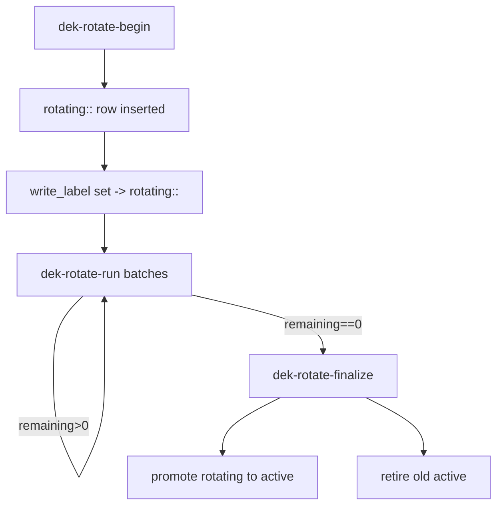

# Encryption Deep Dive

This document expands on the README quick reference and describes the envelope encryption model, rotation workflow, and operational guidelines.

## 1. Data Model

Tables involved:
- `encryption_keys(id, label, dek_wrapped, dek_wrap_nonce, wrap_scheme, kms_key_id, created_at)`
- `encryption_settings(id=1, write_label)` (single-row helper for current write label)
- `transactions(..., description_enc, description_nonce, merchant_raw_enc, merchant_raw_nonce, note_enc, note_nonce, enc_label)`

Columns with suffix `_enc` store ciphertext; `_nonce` stores AES-GCM nonce when in env KEK mode. In KMS mode the nonce is NULL/empty and ciphertext is KMS wrapped DEK; per-row data still uses the DEK for field encryption (hybrid properties handle both).

## 2. Envelope Strategy

1. A single Data Encryption Key (DEK) per label encrypts all selected columns (field-level encryption with shared key per generation/label).
2. The DEK is stored only in wrapped form (row in `encryption_keys`).
3. Wrap scheme options:
   - Env KEK: AES-GCM(wrapped=encrypt(nonce, DEK, AAD?)) with 96-bit random nonce; AAD optional (historically None or `b"dek"`).
   - KMS: `kms_encrypt(DEK)`; `dek_wrap_nonce` is NULL/empty to signal KMS usage.
4. Application unwraps once at startup (`crypto-init` sequence) and caches plaintext DEK in-process only.

## 3. Hybrid Properties

ORM hybrid properties (e.g. `description_text`) perform:
```text
SET: plaintext -> AES-GCM(DEK) => ciphertext + per-field nonce stored in *_enc/*_nonce
GET: ciphertext + nonce -> decrypt(DEK) => plaintext returned
```
This isolates encryption logic from service/business code.

## 4. Rotation vs Rewrap

| Action | Changes Data Rows? | Changes encryption_keys rows? | Purpose |
|--------|--------------------|--------------------------------|---------|
| KEK rewrap | No | Updates existing active row (new dek_wrapped + nonce) | Replace env KEK quickly |
| KMS rewrap (kek->kms) | No | Updates active row (nonce NULL, add kms metadata) | Migrate to KMS |
| DEK rotation | Yes (rewrites encrypted columns, updates enc_label) | Inserts new rotating::<ts> then promotes to active | Compromise containment, crypto hygiene |
| Force new active DEK | No (should be zero encrypted rows) | Retire old active, insert new active | Reset when safe (bootstrap) |

## 5. DEK Rotation Flow



Key rules:
- Only one label is `active` at a time.
- Writes during rotation use the new rotating label (simplifies finalize).
- Finalize re-labels rows as needed and retires prior active label.

## 6. Metrics Exported

When `prometheus_client` is installed:
- `crypto_ready` (Gauge 0/1)
- `crypto_mode_env` (Gauge 1 if env-wrapped active DEK; 0 if KMS)
- `crypto_keys_total` (Gauge count of rows in encryption_keys)
- `crypto_active_label_age_seconds` (Gauge seconds since active key creation if timestamp available)

## 7. Health & Readiness

Endpoints:
- `/healthz` includes `crypto_ready`, `crypto_mode`, `crypto_label`, `crypto_kms_key`.
- `/health/encryption/status` enumerates key labels and schemes.
- `/ready` returns 200 only when DEK is unwrapped (unless `ENCRYPTION_ENABLED=0`).

Suggested probes (Kubernetes):
```yaml
livenessProbe:
  httpGet: { path: /healthz, port: 8000 }
readinessProbe:
  httpGet: { path: /ready, port: 8000 }
```

## 8. Failure Scenarios

| Scenario | Symptom | Mitigation |
|----------|---------|------------|
| Wrong KEK (env) | Unwrap fails at startup | If zero encrypted rows: `force-new-active-dek`; else restore correct KEK from secret manager. |
| Lost KEK & encrypted data | Decrypt failures | Restore from backup or data unrecoverable. |
| KMS permission revoked | 503 readiness / decrypt errors | Restore IAM permissions; ensure service account has `cloudkms.cryptoKeyVersions.useToDecrypt`. |
| Partial rotation interruption | Some rows `enc_label=rotating::<ts>` | Resume with `dek-rotate-run`; rotation is idempotent per row. |

## 9. Backup Checklist

- `encryption_keys` (all rows)
- Application migrations (to preserve wrap scheme compat)
- Secure storage of KEK (if env mode) or KMS key metadata (if KMS mode)

## 10. Hardening Roadmap

- Per-field HMAC for tamper detection.
- Multi-tenant label isolation.
- Periodic automatic rotation cadence with jitter.
- Export rotation diagnostics (processed, failures) as Prometheus counters.

## 11. Local Dev Tips

- You can run with an ephemeral KEK; reinitializing wipes ability to read previously written ciphertext.
- Set `DEV_ALLOW_NO_LLM=1` to skip LLM calls; encryption remains fully active.
- Use `txn-demo` / `txn-show-latest` to sanity check round-trip.

## 12. Glossary

- **DEK**: Data Encryption Key.
- **KEK**: Key Encryption Key (env-provided symmetric key).
- **KMS**: Cloud Key Management Service (Google Cloud KMS in this project).
- **Label**: Logical identifier tying a wrapped DEK to rows encrypted under it.
- **Rewrap**: Change how the DEK itself is wrapped without touching data ciphertext.
- **Rotation**: Issue a new DEK and re-encrypt data under it.

---

For quick commands see the backend README or run `python -m app.cli -h`.
